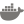

<!--<h1 align="center">Hey, I'm Piotr. But you can also call me Xeno.</h1>-->
<h4 align="center">I am delivering the impossible. Or at least <i>they</i> say so. 
I think that <i>those who are crazy enough to think they can change the world usually do</i>.</h4>

### 💁‍♂️ That's basically who I am:

- 🎩 Co-founder of [Prown](https://prown.io), where I am leading the technological side of the project. We're coming for you, pesky counterfeiters!
- 🕹️ Former Chief Technology Officer at [PWay](https://pway.io) (a subsidiary of [PlayWay](https://playway.com)), where we were developing a blockchain platform for collecting video game ideas.
- 🏦 Former Blockchain Technology Lead at [Alior Bank](https://aliorbank.pl), where I was responsible for the technological aspects of blockchain implementation.
- 👨‍🏫 Lecturer at [The Faculty of Management of the University of Warsaw (FinTech post-diploma course)](https://podyplomowe.wz.uw.edu.pl/fintech/).
- 🎮 Leader of [Xeno's Tale](https://xenostale.pl), a project that tries to extend the life of [NosTale](https://nostale.com) - a MMORPG game from 2006 that I have a huge sentiment for.
- 👨‍🎓 Computer Science student at [Polish-Japanese Academy of Information Technology](https://www.pja.edu.pl/en/).
- 🧙‍♂️ Hobbyist developer, that sometimes conjures up something useful or simply cool. You know, sometimes it happens.

 

&nbsp;
&nbsp;
&nbsp;
&nbsp;
&nbsp;
&nbsp;
&nbsp;
&nbsp;
&nbsp;
&nbsp;

 

&nbsp;
&nbsp;
&nbsp;
&nbsp;
&nbsp;
&nbsp;
&nbsp;
&nbsp;
&nbsp;
&nbsp;
&nbsp;
&nbsp;

 

### 📖 A few facts about me:

- I was the **main responsible person** for the technology behind [Alior Bank's durable medium](https://dokumenty.aliorbank.pl) - one of the **first public blockchain implementations in the financial sector**. When it went into production, I was featured in a couple of articles e.g. on [Forbes](https://www.forbes.com/sites/hanktucker/2019/06/17/polish-bank-alior-uses-public-ethereum-blockchain-for-new-document-authentication-feature/#1294720344a6) and [Yahoo Finance](https://finance.yahoo.com/news/polish-bank-verifies-documents-ethereum-224800320.html).
- Me and [Marcello](https://github.com/marcellobardus) **won** a hackathon with [a NosTale x Minecraft project](https://www.youtube.com/watch?v=O5K6ja4KtkM). Like, [really](https://blog.chronologic.network/whacked-blocks-whats-the-state-of-blockchain-in-poland-3182da837eb3).
- And we also got awarded for the **Best Social Application at ETHLondon UK** in 2020.
- My team's **CMR digitalization** project got awarded for the **Most Visionary Concept at Blockathon** in 2018.
- I was a **semi-finalist** in the second polish edition of **Forbes and McKinsey & Company's 25 under 25**, and also in one of the competitions at **HackYeah 2018**, the biggest hackathon in Europe (to date).

### 🧘‍♂️ Offtopic:

- 😳 You won't notice it, but I'm a very **shy and introvert** person.
- 🎽 I usually attend **hackathons just for the sport**. Rewards are only a nice addition. Actually... I **forgot to claim** some of the things I won.
- 🍍 I’m not an **Apple** fan but I use Apple products. The same goes for the brand with the **three-headed snake logo**.
- 🧭 I like to **travel**. 🇮🇸 Iceland has been my favourite place for a while.
- 🌙 People tend to say I'm **depressed**. If this is true, I think **this is what keeps me going.**
- 🎮 I like **JRPGs**, especially the newer **Monolith Soft** games.
- ♋ But lately I prefer to play **League of Legends** ~~to chill out~~.
